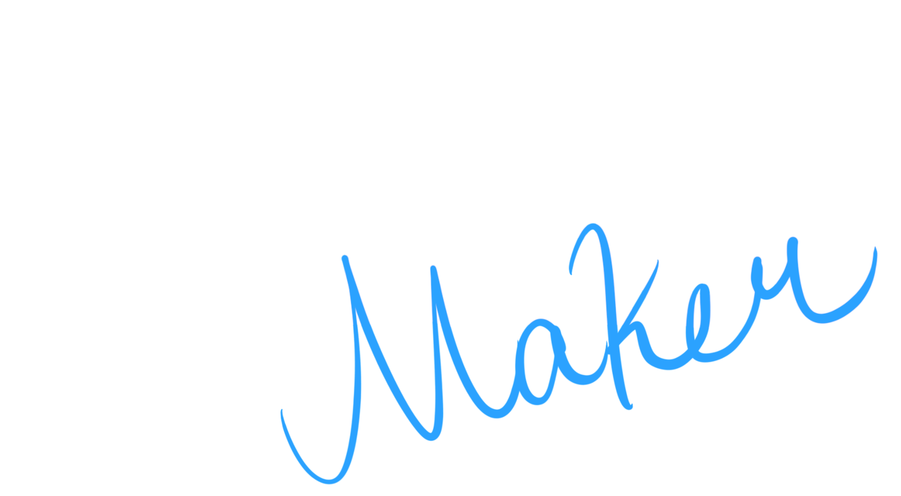

<!-- PROJECT LOGO -->
 

  

  

    <strong>Materloo Maker</strong> is a text-based web game that encourages civic engagement through strategic resource management. Players take on the role of a city planner, balancing public satsifaction and budget constraints to shape a growing community.
     
     
    <a href="https://ericahan22.github.io/materloomaker/">Play here!</a>
  

<!-- ABOUT THE PROJECT -->
## About

As the new Planning & Development officer at the City of Materloo, you are tasked with the city's strategic planning. As proposals are submitted for new developments and land-use changes, you must consult with experts and community members to decide on what to build, while taking into account the amount of money the city has to work with. Your decisions have lasting impacts on the community and will shape the future of the residents you serve.

### Built With

- [Twine](https://twinery.org/)
- HTML/CSS
- JavaScript
